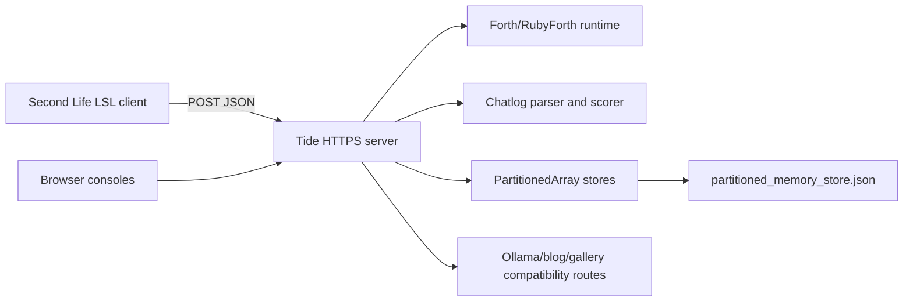

# Tiade Maeepers Server: Complete Documentation

This is the canonical maintainer and operator guide for the Rust/Tide service in
this directory. It covers the server process, persistence model, HTTP API,
chatlog moderation dashboard, Forth/RubyForth runtime, Second Life bridge, LSL
client, utility applications, and verification workflow.

The implementation is intentionally concentrated in `src/main.rs`. The current
Second Life client is `src/Mindweave.lsl`; older references to
`Relote.Stack.Service.lsl` describe the same client family but may not match the
checked-in filename.

## Contents

1. [System Overview](#system-overview)
2. [Requirements and Configuration](#requirements-and-configuration)
3. [Run and Deploy](#run-and-deploy)
4. [Persistence and Recovery](#persistence-and-recovery)
5. [HTTP API](#http-api)
6. [Chatlog Moderation](#chatlog-moderation)
7. [Forth and RubyForth](#forth-and-rubyforth)
8. [Second Life Bridge](#second-life-bridge)
9. [LSL Client](#lsl-client)
10. [Other Applications](#other-applications)
11. [Security and Operations](#security-and-operations)
12. [Testing and Troubleshooting](#testing-and-troubleshooting)
13. [Repository Map](#repository-map)

## System Overview

The service is an async Rust application built on Tide and `async-std`. It
provides:

- A durable partitioned-array store for chatlog rows, variables, history,
  notecards, matrices, bridge jobs, and custom moderation words.
- Forth and a deliberately limited Ruby-shaped language called RubyForth.
- A browser Forth console and a Second Life HTTP/LSL client.
- Chatlog ingestion, moderation scoring, quarantine reporting, analytics, and
  Markov transition views.
- Sigil-deck and flashcard pages.
- Legacy utility, blog, gallery, admin, and Ollama relay routes.

The service is normally exposed through HTTPS. Tide route registration happens
in `src/main.rs`; the Ollama, blog, gallery, and admin compatibility families
are mounted by sibling modules/crates.

### Request flow



## Requirements and Configuration

### Build requirements

- Rust toolchain compatible with edition 2024.
- The sibling local crate `../lib/partitioned_array_rust`.
- A working TLS certificate and private key for the default HTTPS listener.
- Ruby (the rbenv version in `.ruby-version`, built with shared-library
  support). Magnus embeds it in-process for the `/time`, `/weather`, `/ae`, and
  moon/sun routes; see `src/ruby_vm.rs`. No external Ruby helper is required.

Install dependencies and compile from this directory:

```sh
cargo check
cargo build --release
```

### Environment variables

| Variable | Default | Purpose |
| --- | --- | --- |
| `MSSL_ADDRESS` | `0.0.0.0:443` | HTTPS listen address. |
| `MSSL_CERT_PATH` | `/etc/letsencrypt/live/stimky.info/fullchain.pem` | TLS certificate. |
| `MSSL_KEY_PATH` | `/etc/letsencrypt/live/stimky.info/privkey.pem` | TLS private key. |
| `MSSL_MEMORY_STORE_PATH` | `/root/midscore_io/tiade-maeepers-saerver-all/partitioned_memory_store.json` | Atomic JSON snapshot path. |
| `MSSL_FORTH_BRIDGE_TOKEN` | unset | Enables and authenticates the Second Life bridge when nonempty. |
| `MSSL_FORTH_FILE_ROOT` | `.../forth_files` | Root for session-scoped Forth files. |
| `OLLAMA_TEAM_PROMPT_TOKEN` | unset | Enables Ollama team prompt management. |

The bridge token is a bearer secret. Do not put it in a public repository, URL,
log message, or browser source. Configure the same value in the LSL object only
when that object is trusted.

## Run and Deploy

### Development

Use a nonprivileged port while developing:

```sh
export MSSL_ADDRESS=127.0.0.1:8443
export MSSL_CERT_PATH=/path/to/dev/fullchain.pem
export MSSL_KEY_PATH=/path/to/dev/privkey.pem
cargo run
```

For the normal project scripts:

```sh
./start.sh
./stop-server.sh
```

`start-with-wasm.sh` additionally builds and serves the browser WebAssembly
client. The exact certificate and process permissions still apply.

### Release checklist

1. Run `cargo check` and the focused API checks below.
2. Set an explicit `MSSL_MEMORY_STORE_PATH` on durable storage.
3. Set `MSSL_FORTH_BRIDGE_TOKEN` to a long random value, or leave it unset if
   Second Life integration is not required.
4. Verify certificate and key permissions.
5. Put authentication, rate limiting, and request-size limits at the reverse
   proxy for public admin and mutation routes.
6. Start the release binary and inspect the first startup and TLS messages.
7. Confirm `/forth`, `/chatlog`, and `/chatlog/words/list` before connecting an
   in-world object.

## Persistence and Recovery

### Stores

The application state contains these partitioned arrays:

| Store | Contents |
| --- | --- |
| `chatlog_store` | Raw bodies received by `/sl_logger`, with receive time and revision. |
| `vars_store.entries` | Variables, matrices, and persisted notecard values. |
| `vars_store.history` | Variable operation snapshots. |
| `forth_bridge_queue` | Queued Forth/Ruby jobs awaiting an LSL poll. |
| `custom_words` | Admin-managed moderation dictionary entries. |
| `chatlog_cache` | In-memory rendered dashboard cache; rebuilt after restart. |

The durable snapshot is a JSON serialization of the first five stores. It is
written by `persist_memory_stores` to a temporary sibling file and then renamed
into place. This keeps a completed snapshot intact if the process stops during
serialization.

### Durability boundaries

- `/sl_logger` persists after appending each accepted body.
- Custom-word add and delete routes persist after each mutation.
- Bridge enqueue/dequeue state is persisted with the normal memory snapshot.
- The shutdown handler persists once more on clean exit.
- A crash can lose changes made since the last completed snapshot.
- Bridge polling removes a job when it is delivered. A later execution error
  does not automatically requeue that job; retryable programs should be
  idempotent.

To restore state, start the service with the same `MSSL_MEMORY_STORE_PATH`.
If the file is missing, unreadable, or has an unsupported version, empty stores
are created. Back up the snapshot before migrations or manual edits.

## HTTP API

All JSON POST requests should send:

```http
Content-Type: application/json
```

Unless stated otherwise, successful JSON responses use `application/json`.
Session IDs are 1-64 ASCII letters, digits, `_`, or `-`. The default HTTP
session is `default`; `src/Mindweave.lsl` uses the containing prim UUID.

### Core and ingestion

| Method | Path | Contract |
| --- | --- | --- |
| POST | `/sl_logger` | Stores the raw request body as one chatlog row and persists the snapshot. |
| GET | `/analytics` | Returns text analytics from the in-memory chatlog store. |
| POST | `/echo` | Returns the request body with a small wrapper. |
| GET | `/` | Main site entry response. |
| POST | `/restart-servers` | Persists state and signals the managed server process. Protect this route. |

### Variables and register programs

| Method | Path | Contract |
| --- | --- | --- |
| POST | `/vars/set` | Set all fields except optional `session_id`. |
| POST | `/vars/get` | Body `{"name":"key","session_id":"..."}`. |
| POST | `/vars/view` | Returns the visible variables for the session. |
| POST | `/vars/delete` | Body `{"name":"key"}`. |
| POST | `/vars/clear` | Clears the selected session. |
| POST | `/vars/history` | Returns operation history for the selected session. |
| POST | `/vars/status` | Returns count and session metadata. |
| POST | `/program/run` | Runs bounded JSON register instructions. |
| GET | `/program/example` | Returns a decrementing-loop program. |

The JSON register VM supports `set`, `increment`, `decrement`, `label`, `jump`,
`jump_if_nonzero`, and `halt`. A program must set `max_steps` between 1 and
1,000,000 or use the 10,000-step default.

### Forth and RubyForth routes

| Method | Path | Contract |
| --- | --- | --- |
| GET | `/forth` | Machine-readable runtime catalog. |
| GET | `/forth/ui` | Browser console. |
| GET | `/ruby` | RubyForth capability description. |
| POST | `/forth/eval` | Body `source`, optional `max_steps`, `session_id`. |
| POST | `/ruby/eval` | Same body shape; compiles RubyForth then runs it. |
| POST | `/sessions/:session_id/forth/eval` | Uses the path session. |
| POST | `/sessions/:session_id/ruby/eval` | Uses the path session. |
| GET | `/sessions/:session_id/status` | Reads one session without executing code. |
| GET | `/forth/example` | Returns a Forth countdown example. |
| POST | `/forth/algebra` | Polynomial simplify/derivative/integral/evaluation. |

Typical request:

```sh
curl -sS "$BASE/sessions/demo/forth/eval" \
  -H 'Content-Type: application/json' \
  -d '{"source":"2 3 + puts","max_steps":1000}'
```

### Notecards, matrices, and files

| Method | Path | Contract |
| --- | --- | --- |
| POST | `/forth/notecards/save` | Save `name`, `source`, optional `session_id`. |
| POST | `/forth/notecards/get` | Read one named notecard. |
| POST | `/forth/notecards/list` | List session notecards. |
| POST | `/forth/notecards/run` | Execute a saved Forth notecard. |
| POST | `/ruby/notecards/run` | Compile and execute a saved RubyForth notecard. |
| POST | `/forth/notecards/delete` | Delete one notecard. |
| POST | `/forth/matrices/get` | Read a named persisted matrix. |
| POST | `/forth/files/write` | Write a bounded UTF-8 file. |
| POST | `/forth/files/read` | Read a session-scoped file. |
| POST | `/forth/files/list` | List session files. |
| POST | `/forth/files/delete` | Delete a session file. |

File names are restricted to safe basenames. Files are sandboxed storage, not
an execution mechanism. The runtime limits file content to 65,536 bytes and
matrix dimensions/cells through explicit bounds documented by `/forth`.

### Second Life bridge

| Method | Path | Contract |
| --- | --- | --- |
| POST | `/forth/bridge/enqueue` | Authenticated body: `token`, `source`, optional `language`, `max_steps`, `session_id`. |
| POST | `/forth/bridge/poll` | Authenticated body: `token`, optional `session_id`; returns one matching job. |

`language` is `forth` or `ruby`. Enqueue accepts at most 65,536 source bytes
and the queue is bounded. Polling removes the delivered item and returns
`message: null` when no matching job exists.

### Chatlog and moderation

| Method | Path | Contract |
| --- | --- | --- |
| GET | `/chatlog` | Moderation dashboard HTML. |
| GET | `/chatlog?format=summary` | Statistics JSON. |
| GET | `/chatlog?format=recent` | Latest 50 scored messages as JSON. |
| GET | `/chatlog/summary` | Redirect to summary JSON. |
| GET | `/chatlog/recent` | Redirect to recent JSON. |
| GET | `/chatlog/admin` | Redirect to summary JSON. |
| GET | `/chatlog/markov` | Markov generation console. |
| GET | `/chatlog/markov.json` | Generated samples as JSON. |
| GET | `/chatlog/markov/transitions.json` | Transition counts and probabilities. |
| GET | `/chatlog/words` | Custom dictionary browser console. |
| GET | `/chatlog/words/list` | Lists categories and custom entries. |
| POST | `/chatlog/words/add` | Upsert `category`, `word`, optional `score`. |
| POST | `/chatlog/words/delete` | Delete `category` and `word`. |

## Chatlog Moderation

### Ingestion format

`/sl_logger` stores the body without rewriting it. The dashboard extracts
JSON objects from the stored text, tolerates nested braces and braces inside
quoted strings, and records integrity counters for parse errors, missing fields,
invalid timestamps, and invalid positions.

Expected useful fields include:

```json
{
  "avatar_id": "uuid",
  "avatar_name": "Resident Name",
  "sim_name": "Region",
  "message": "hello",
  "timestamp": 1730000000,
  "x_pos": 128.0,
  "y_pos": 64.0,
  "z_pos": 22.0,
  "captured_by": "logger-node"
}
```

### Scoring

Each message is tokenized into lowercase alphanumeric words. Four dictionaries
produce independent scores: hostile, positive, drug, and slang. The dashboard
also derives tags, sentiment, quarantine state, avatar/region summaries,
logger concentration, time distributions, movement transitions, and a position
heatmap.

A message is flagged when it matches a hard phrase, reaches the hostile/drug
threshold, combines high slang and hostility, or reaches the total-score
threshold. This is an operational triage signal, not an automatic moderation or
ban decision.

### Custom words

The custom console accepts exactly four categories: `hostile`, `positive`,
`drug`, and `slang`. Words are trimmed, lowercased, and limited to 1-32 ASCII
letters or numbers. Scores are clamped to `-10..=10`; omitted scores default to
`2`.

```sh
curl -sS "$BASE/chatlog/words/add" \
  -H 'Content-Type: application/json' \
  -d '{"category":"hostile","word":"exampleterm","score":4}'

curl -sS "$BASE/chatlog/words/list"

curl -sS "$BASE/chatlog/words/delete" \
  -H 'Content-Type: application/json' \
  -d '{"category":"hostile","word":"exampleterm"}'
```

Custom entries are persisted and merged into the corresponding built-in map on
each `/chatlog` scoring pass. Updating an existing `(category, word)` changes
its score rather than creating a duplicate.

## Forth and RubyForth

Forth is a bounded stack interpreter. RubyForth is a restricted Ruby-shaped
frontend compiled into the same Forth runtime and session store. It is not a
 general Ruby interpreter and intentionally does not expose gems, `eval`,
`require`, arbitrary classes, methods, subprocesses, or unrestricted file
access.

### Core words

| Group | Words |
| --- | --- |
| Arithmetic | `+ - * / mod abs min max rand now` |
| Comparison | `= != < <= > >= 0=` |
| Boolean | `true false nil not and or` |
| Stack | `dup drop swap over` |
| Output | `. puts p` |
| Variables | `variable let @ ! $name name= name+= name-=` |
| Control | `if else then begin until again bye` |
| Collections | `array hash c.len c.get c.set c.push c.pop c.delete c.has? c.keys` |
| Matrices | `matrix m.identity mget mset m.fill m.scale m.add m.sub m.mul m.solve m.transpose m.det m.rows m.cols m.show` |
| Second Life calls | `sl.say sl.whisper sl.shout sl.region_say sl.owner_say sl.set_text sl.set_color sl.set_alpha sl.play_sound sl.set_timer sl.set_region_pos sl.link_message` |

Example:

```forth
: square dup * ;
6 square puts
```

Execution is capped at 10,000 steps by default and 1,000,000 maximum. Host
calls are also capped. Runtime responses include output, stack, variables,
session ID, and an allowlisted `calls` array when applicable.

### Sessions

A session isolates logical variables, history, notecards, matrices, files, and
bridge queue selection. Named sessions are useful for separating objects,
players, tests, or teams. The path-session routes are preferred for server
clients because the session is explicit in the URL.

## Second Life Bridge

The bridge has two independent directions:

1. The LSL object sends source directly to `/forth/eval` or `/ruby/eval`.
2. A browser or service enqueues source, and the LSL object polls it through
   `/forth/bridge/poll`.

The server evaluates source and returns structured `calls`. The LSL client does
not execute arbitrary returned source; it recognizes fixed operation names and
maps them to functions such as `llSay`, `llOwnerSay`, `llSetText`,
`llSetColor`, `llSetAlpha`, `llTriggerSound`, `llSetTimerEvent`,
`llSetRegionPos`, and `llMessageLinked`.

### Enqueue and poll example

```sh
export MSSL_FORTH_BRIDGE_TOKEN='use-a-long-random-secret'

curl -sS "$BASE/forth/bridge/enqueue" \
  -H 'Content-Type: application/json' \
  -d '{"token":"use-a-long-random-secret","session_id":"object-1","language":"forth","source":"0 \"hello from bridge\" sl.owner_say"}'

curl -sS "$BASE/forth/bridge/poll" \
  -H 'Content-Type: application/json' \
  -d '{"token":"use-a-long-random-secret","session_id":"object-1"}'
```

A queue item is selected only when its session matches the poll session. Use a
stable session name when a browser and an LSL object need to share a queue.

## LSL Client

The current checked-in client is `src/Mindweave.lsl`. Configure:

```lsl
string SERVERURL = "https://your-server.example";
string BRIDGE_TOKEN = "";
integer CHANNEL_INPUT = 1111;
integer CHANNEL_OUTPUT = 0;
```

Drop the script into an owned object, save it, and use:

```text
/1111 help
/1111 forth 2 3 + puts
/1111 ruby count = 1; puts count; count += 1; puts count
/1111 session workshop_1
/1111 bridge-on
```

Only the object owner is accepted by the chat listener. HTTP requests are
asynchronous: each request is recorded in a local ledger and later routed by
request key in `http_response`. Bridge polling is timer-driven and prevents
parallel polls. Use notecards for multiline source.

Detailed command and event documentation remains in:

- [SECOND_LIFE_SERVICE_GUIDE.md](SECOND_LIFE_SERVICE_GUIDE.md)
- [LSL_CLIENT_REFERENCE.md](LSL_CLIENT_REFERENCE.md)

## Other Applications

### Sigil deck and flashcards

The sigil application stores metadata in `sigil_deck_data/deck.json` and image
files in its upload directory. Routes include:

- `GET /sigil-deck`, `/sigil-deck/card/:id`, `/sigil-deck/random`
- `POST /sigil-deck/upload`
- `POST /sigil-deck/card/:id/update`
- `POST /sigil-deck/card/:id/delete`
- `GET /sigil-deck/image/:filename`
- `GET /flashcard`

Uploaded images are normalized and constrained by the image-side limit in
`src/main.rs`. Filenames are checked as safe basenames before file access.

### Ollama, blog, gallery, and admin compatibility

These route families are maintained for compatibility with the surrounding
application. Their detailed matrix is in [README.md](README.md) and the relay
route list is in [OLLAMA_ROUTES.txt](OLLAMA_ROUTES.txt). Treat admin, prompt,
restart, upload, and delete routes as privileged operations at the deployment
boundary.

### Legacy utilities

The service also retains `/time`, `/weather`, `/ae`, `/tiade/moon`,
`/tiade/sun`, `/random`, `/random2`, `/rneutri`, `/rneutrialg`, `/bridge/*rest`,
`/tiade-maepers/*rest`, `/parse_plink`, `/tiade/img/resize`, `/file/add`, and
`/file/delete`. These routes exist for compatibility and should not be exposed
publicly without the same proxy controls as other mutation or process routes.

## Security and Operations

- Put authentication and rate limiting in front of public deployments. The
  custom-word routes and `/sl_logger` currently rely on deployment-level access
  control rather than an application login.
- Do not expose bridge tokens, TLS private keys, memory snapshots, or server
  logs to the browser.
- Keep `/restart-servers`, file mutation routes, admin routes, prompt mutation,
  and upload/delete routes behind an authenticated proxy.
- Use a dedicated `MSSL_FORTH_FILE_ROOT`; do not point it at a source tree or
  sensitive system directory.
- Review quarantine output as a queue of signals. Dictionary scores are
  configurable heuristics and can produce false positives.
- Back up `partitioned_memory_store.json` and `sigil_deck_data` together when
  taking an application backup.
- Use a temporary memory-store path for tests so production data is untouched.

## Testing and Troubleshooting

### Compile and diagnostics

```sh
cargo check
cargo build --release
```

The project currently has pre-existing unused/deprecation warnings. A successful
check must still end with `Finished` and report zero errors.

### API smoke tests

```sh
BASE=https://your-server.example
curl -fsS "$BASE/forth" >/dev/null
curl -fsS "$BASE/chatlog/words/list" >/dev/null
curl -fsS "$BASE/sessions/smoke/forth/eval" \
  -H 'Content-Type: application/json' \
  -d '{"source":"2 3 + puts"}'
```

### Persistence test

1. Set `MSSL_MEMORY_STORE_PATH` to a temporary file.
2. POST one `/sl_logger` body and one custom word.
3. Stop the process cleanly.
4. Start with the same path.
5. Verify `/chatlog?format=recent` and `/chatlog/words/list` still contain them.

### Bridge test

1. Configure the same token on the server and `src/Mindweave.lsl`.
2. Enqueue a harmless `sl.owner_say` job for the prim UUID or named session.
3. Use `/1111 bridge-on`.
4. Confirm the object receives and executes the call.
5. Test a wrong token and verify the server returns unauthorized.
6. Use `/1111 bridge-off` when finished.

### Common failures

| Symptom | Likely cause | Check |
| --- | --- | --- |
| TLS startup fails | Certificate/key path or permissions | `MSSL_CERT_PATH`, `MSSL_KEY_PATH`, server log. |
| State starts empty | Wrong snapshot path or invalid snapshot | `MSSL_MEMORY_STORE_PATH`, JSON file, file permissions. |
| LSL receives no response | Wrong URL, TLS trust, or request body | Server log and `SERVERURL`; test with curl. |
| Bridge returns no message | Session mismatch or empty queue | Compare `SESSION_ID` with enqueue `session_id`. |
| Bridge unauthorized | Token mismatch or server token unset | Compare exact nonempty token values. |
| Word add rejected | Invalid category or non-ASCII/multicharacter token | Use one 1-32 character ASCII alphanumeric word. |
| Chatlog appears stale | Render cache or unchanged source revision | Retry with `cache: no-store`; post through `/sl_logger`. |
| Forth fails at step limit | Loop exceeds `max_steps` | Increase within 1,000,000 or simplify the program. |

## Repository Map

| Path | Role |
| --- | --- |
| `src/main.rs` | Tide server, state, runtime, routes, chatlog, utilities. |
| `src/Mindweave.lsl` | Current Second Life client and bridge poller. |
| `README.md` | Project overview and broad route matrix. |
| `TIDE_ROUTE_MANUAL.md` | Route-focused API manual and isolation checks. |
| `SECOND_LIFE_SERVICE_GUIDE.md` | Operator-facing LSL command guide. |
| `LSL_CLIENT_REFERENCE.md` | Internal LSL event/request lifecycle reference. |
| `partitioned_memory_store.json` | Durable runtime snapshot; deployment data. |
| `sigil_deck_data/` | Sigil metadata and uploaded images. |
| `tiade_ollama_relay/` | Mounted Ollama/chat/game route implementation. |
| `ruby_client/` | Ruby HTTP client examples. |
| `wasm_client/` | Browser WebAssembly client. |
| `start.sh`, `start-with-wasm.sh`, `stop-server.sh` | Process/build helpers. |

## Canonical References

When documents disagree, verify behavior against `src/main.rs` and the current
`src/Mindweave.lsl`, then update this guide and the narrower guide that was
wrong. The route catalog at `GET /forth` is the runtime's machine-readable
language contract; `GET /chatlog/words/list` is the runtime's custom dictionary
contract.

`src/main.rs` contains historical code blocks, duplicate compatibility snippets,
and commented-out route experiments. This guide documents registered, executable
routes only. A path mentioned in an old comment or example is not necessarily
available in the running server; confirm it in the active `app.at(...)` route
registration or with a live request before relying on it.
