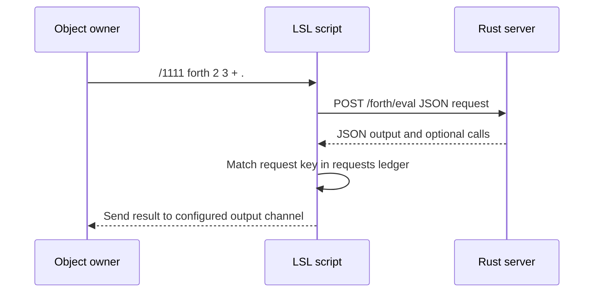
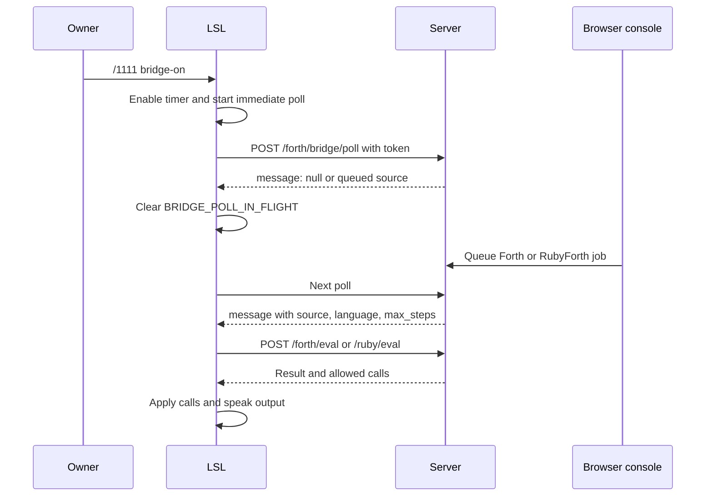

# Relote Stack Service LSL Client Reference

This document explains how `src/Relote.Stack.Service.lsl` works internally.
It is intended for someone editing, operating, or debugging the script in
Second Life, rather than only using its chat commands.

For the complete server-side route list, see
[TIDE_ROUTE_MANUAL.md](TIDE_ROUTE_MANUAL.md).

The script is an owner-only asynchronous HTTP client. It receives nearby-chat
commands, sends JSON requests to the Rust server, remembers why each request
was made, and handles the response later in `http_response`.

## Table of Contents

1. [Runtime Model](#runtime-model)
2. [Configuration and Global State](#configuration-and-global-state)
3. [Startup and Chat Input](#startup-and-chat-input)
4. [Outgoing HTTP Requests](#outgoing-http-requests)
5. [Response Routing](#response-routing)
6. [Forth-Controlled Object Calls](#forth-controlled-object-calls)
7. [Bridge Polling in Detail](#bridge-polling-in-detail)
8. [Notecard Upload State Machine](#notecard-upload-state-machine)
9. [Variable Cache and Escaping](#variable-cache-and-escaping)
10. [Limits, Permissions, and Failure Modes](#limits-permissions-and-failure-modes)
11. [Operator Checklist](#operator-checklist)

## Runtime Model

LSL scripts do not wait synchronously for web requests. Calling `llHTTPRequest`
returns a request key immediately; the actual response arrives later through the
`http_response` event. This script is designed around that asynchronous model.

There are four main event sources:

| Event | What causes it | What this script does |
| --- | --- | --- |
| `state_entry` | Script starts or resets. | Opens the chat listener and announces readiness to the owner. |
| `listen` | Someone speaks on the input channel. | Verifies ownership, parses a command, and usually starts an HTTP request. |
| `http_response` | A previous `llHTTPRequest` finishes. | Matches the response to its saved request context, prints output, caches values, or applies Forth-generated calls. |
| `timer` | The configured timer interval elapses. | Attempts one bridge poll. |
| `dataserver` | Second Life returns a requested notecard line. | Accumulates the notecard and uploads it when `EOF` arrives. |

The script does not run arbitrary code received from the server. The server may
return a restricted JSON `calls` array; `run_forth_calls` recognizes a fixed
set of operation names and maps them to explicit LSL functions.



## Configuration and Global State

The editable configuration appears near the top of the script.

| Name | Type | Default | Meaning |
| --- | --- | --- | --- |
| `SERVERURL` | `string` | `https://stimky.info` | HTTPS base URL. Every endpoint string is appended to this value. Do not include a trailing slash unless endpoint paths are adjusted too. |
| `API_KEY` | `string` | empty | Reserved but unused by this script. Setting it currently does not authenticate requests. |
| `BRIDGE_TOKEN` | `string` | empty | Shared secret for the browser-to-Second-Life bridge. It must exactly match the server environment variable `MSSL_FORTH_BRIDGE_TOKEN`. |
| `CHANNEL_INPUT` | `integer` | `1111` | Nearby-chat channel on which commands are received. |
| `CHANNEL_OUTPUT` | `integer` | `0` | Default channel for command results. Channel `0` is public chat. |
| `BRIDGE_POLL_SECONDS` | `float` | `3.0` | Requested interval between bridge poll attempts. |
| `SESSION_ID` | `string` | current prim UUID | Session attached to language, notecard, file, and bridge requests. It can be changed by the owner with `session <name>`. |

The remaining globals are runtime state, not configuration:

| Name | Purpose |
| --- | --- |
| `requests` | Flat request ledger. Each outbound request occupies three list items: request key, action label, and action argument. |
| `POST_HEADERS` | Shared `llHTTPRequest` options: HTTP `POST` and JSON MIME type. |
| `kv` | Local key/value cache populated only after successful `get` responses. It is not durable and is cleared by reset. |
| `BRIDGE_ENABLED` | Whether timer-driven polling is allowed. |
| `BRIDGE_POLL_IN_FLIGHT` | Prevents overlapping bridge polls. It is set before sending a poll and cleared when a nonempty bridge response is handled. |
| `notecard_query` | The key returned by the most recent `llGetNotecardLine` request. It identifies which `dataserver` replies belong to this upload. |
| `notecard_line` | Zero-based line number currently being fetched. |
| `notecard_name` | Inventory name and remote name of the notecard being uploaded. |
| `notecard_source` | Accumulated source text while a notecard is loading. |

### Prim sessions

At `state_entry`, the client sets `SESSION_ID` to `(string)llGetKey()`. In
Second Life, `llGetKey()` identifies the object containing the script, so two
different prims normally use two different language partitions even when they
share one server URL.

The owner can deliberately select a shared named partition:

```text
/1111 session team_alpha
/1111 ruby score = 10; puts score
/1111 session-reset
```

`forth_post` adds `session_id` to every JSON payload it sends. The server
validates the name and stores Forth/RubyForth values, memory cells, matrices,
and notecards under that partition in the existing Rust
`partitioned_array_rust` store. Resetting the LSL script returns the client to
its prim UUID; it does not erase server data.

### Shared HTTP options

`POST_HEADERS` is the list passed to every `llHTTPRequest` call. It tells
Second Life to use `POST` and advertise `application/json`. The script does
not currently send custom authorization headers, retry settings, or explicit
timeouts; platform defaults apply.

## Startup and Chat Input

### `on_rez`

`on_rez` only tells the owner that the object was rezzed and reminds them of the
default `/1111` input channel. It does not reset variables, re-open the listen
handle, or enable bridge polling by itself.

### `state_entry`

`state_entry` runs when the script starts or resets. It calls:

```lsl
llListen(CHANNEL_INPUT, "", NULL_KEY, "");
```

This creates a nearby-chat listener on `CHANNEL_INPUT`. The empty name and
message filters mean it hears all speakers and messages on that channel. The
owner check occurs in the `listen` event instead.

### `listen`

The `listen` handler receives four values: channel, speaker name, speaker key,
and message. The current script uses the speaker key and message.

```lsl
if (id != llGetOwner()) return;
```

This is the authorization boundary for chat commands. A non-owner can speak on
the known channel, but the script immediately ignores that message. Ownership
changes automatically change which avatar is authorized because `llGetOwner()`
is evaluated for each message.

The message is split by spaces with `llParseString2List`. The first token is
lower-cased and treated as the command. The rest of the tokens become command
arguments. This has two practical consequences:

1. Command names are case-insensitive because of `llToLower`.
2. Quotes are not interpreted by the chat parser. They are passed through as
   ordinary characters after the command is reconstructed with
   `llDumpList2String`; the server language parser handles those quotes later.

Unknown commands are silently ignored because the diagnostic line at the end of
`listen` is commented out. Uncomment it during development if visible owner
feedback is useful.

## Outgoing HTTP Requests

### Request ledger

The script needs to know what each later response means. `forth_post` therefore
saves a three-item record immediately after starting a request:

```lsl
key request_id = llHTTPRequest(SERVERURL + endpoint, POST_HEADERS, payload);
requests += [(string)request_id, action, argument];
```

For example, a Forth command saves a record shaped like:

```text
["request-uuid", "forth", "0"]
```

The action label tells `http_response` how to decode the body. The argument
usually preserves an output channel, a variable name, or a notecard name.
Because it stores the actual request key, responses may safely arrive in a
different order than commands were sent.

### Payload helpers

| Helper | JSON returned | Used by |
| --- | --- | --- |
| `forth_name_payload(name)` | `{"name":"..."}` | Named matrices, files, and notecards. |
| `forth_file_payload(name, content)` | `{"name":"...","content":"..."}` | File writes. |
| `forth_source_payload(source, max_steps)` | `{"source":"..."}` and optionally `max_steps` | `hybrid`, `forth-steps`, and `ruby-steps`. |
| `forth_name_steps_payload(name, max_steps)` | `{"name":"...","max_steps":...}` | Step-limited notecard runs. |
| `forth_bridge_payload()` | `{"token":"..."}` | Bridge polls. |

`llJsonSetValue` is used instead of manual JSON construction. It correctly
escapes JSON strings such as program source or file content.

### Endpoint families

The command handlers map to these server route families:

| Route family | Typical commands | Response action |
| --- | --- | --- |
| `/vars/*` | `set`, `get`, `view`, `delete`, `clear`, `status`, `history` | Variable action label. |
| `/forth/eval` | `forth`, `forth-say`, `forth-steps`, `hybrid` | `forth` |
| `/ruby/eval` | `ruby`, `ruby-say`, `ruby-steps` | `forth`, because the response format matches Forth evaluation. |
| `/forth/algebra` | `algebra`, `algebra-say` | `algebra` |
| `/forth/files/*` | File commands | `file-read`, `files`, `file-write`, or `file-delete` |
| `/forth/notecards/*` | Upload/list/get/run/delete commands | `notecard-*` or `forth` |
| `/ruby/notecards/run` | RubyForth notecard runs | `forth` |
| `/forth/bridge/poll` | Internal bridge polling | `bridge` |

Every language-bearing request also carries `session_id`. For the bridge, that
means the object polls for jobs associated with its active session. To move a
bridge object into a shared queue, set the same safe session name in each
object before sending `bridge-on`.

## Response Routing

`http_response` receives the original request key, HTTP status, metadata, and
body. Its first job is to find the key in `requests`:

```lsl
integer idx = llListFindList(requests, [rid]);
```

If no record exists, the response is ignored. Otherwise it reads the action and
argument beside that key, then removes all three entries from the ledger. This
prevents completed requests from leaking memory.

The script currently checks whether `body` is empty before checking the HTTP
status. This means an HTTP error with a nonempty body may be printed as output;
an empty body is silently ignored. Operators diagnosing a failure should use
the server log and, temporarily, uncomment the commented debug lines.

Response action behavior:

| Action | Handler behavior |
| --- | --- |
| `bridge` | Clears the in-flight poll flag, optionally starts evaluation of the queued Forth or RubyForth source. |
| `forth` | Applies allowlisted JSON calls, then speaks `output` on the saved reply channel. |
| `file-read` | Extracts `content` when available and sends it in chat-safe chunks. |
| `algebra` | Formats simplified polynomial, derivative, and integral. |
| `matrix`, `files`, `file-write`, `file-delete` | Sends the complete response body on the channel saved in the request argument. |
| Other actions | Sends the complete response body on the current `CHANNEL_OUTPUT`. |

`say_chunks` splits long strings into at most 900-character pieces. This stays
below Second Life's approximately 1,023-byte chat-message limit and avoids
silently truncated file or matrix output.

## Forth-Controlled Object Calls

Forth and hybrid evaluation responses can contain a JSON array named `calls`.
`run_forth_calls` starts at index zero and continues until
`llJsonGetValue(body, ["calls", index])` returns `JSON_INVALID`. Each item must
be a JSON object with an `op` field.

The script only recognizes the following operations:

| JSON `op` | Required fields | LSL call | Notes |
| --- | --- | --- | --- |
| `say` | `channel`, `message` | `llSay` | Local chat, normally up to 20 meters. |
| `whisper` | `channel`, `message` | `llWhisper` | Short-range local chat. |
| `shout` | `channel`, `message` | `llShout` | Longer-range local chat. |
| `region_say` | `channel`, `message` | `llRegionSay` | Region-wide channel message. |
| `owner_say` | `message` | `llOwnerSay` | Delivers only to the current owner. |
| `set_text` | `text`, `red`, `green`, `blue`, `alpha` | `llSetText` | Sets floating text above the object. |
| `set_color` | `red`, `green`, `blue`, `face` | `llSetColor` | Changes one face or all faces with `-1`. |
| `set_alpha` | `alpha`, `face` | `llSetAlpha` | Changes one face or all faces with `-1`. |
| `play_sound` | `sound`, `volume` | `llPlaySound` | Subject to asset and parcel rules. |
| `set_timer` | `seconds` | `llSetTimerEvent` | Replaces this script's existing timer interval. |
| `set_region_pos` | `x`, `y`, `z` | `llSetRegionPos` | Requires normal Second Life permissions and region conditions. |
| `link_message` | `link`, `code`, `message`, `id` | `llMessageLinked` | Delivers a linked-message event to scripts in the linkset. |

An unknown operation is ignored rather than evaluated. This is important: the
server cannot make arbitrary LSL calls merely by choosing an arbitrary function
name in JSON.

### Color and alpha conversion

The server can send a component as normalized `0` through `1`, or as familiar
RGB-like `0` through `255`. `color_component` converts numbers over one by
dividing them by 255, then clamps the result to the `0` through `1` range.
`alpha_component` uses the same rule.

Examples:

| Server value | Value sent to LSL |
| --- | --- |
| `0` | `0.0` |
| `1` | `1.0` |
| `128` | about `0.502` |
| `255` | `1.0` |
| `-5` | `0.0` |
| `400` | `1.0` |

### Timer interaction warning

`sl.set_timer` calls `llSetTimerEvent` on this exact script. There is only one
LSL timer per script. If bridge polling is enabled, remote code that sets a
five-second timer changes the bridge poll interval from three seconds to five
seconds. Setting it to `0` disables the timer and stops automatic polling until
`bridge-on` is issued again. Avoid `sl.set_timer` in bridge jobs unless that
interaction is deliberate.

## Bridge Polling in Detail

The bridge carries jobs from the server's browser console to this particular
in-world object. It does not listen for ordinary chat commands from the
browser. Instead, the object repeatedly asks the server whether one job is
queued for the shared token.

### Prerequisites

Before polling can work, all of these must be true:

1. The server process was started with a nonempty
	`MSSL_FORTH_BRIDGE_TOKEN` environment variable.
2. `BRIDGE_TOKEN` in the object script contains exactly the same value.
3. The object has outbound HTTP permission and can reach `SERVERURL` over HTTPS.
4. The object owner sends `/1111 bridge-on` after saving or resetting the script.
5. A browser user queues a job with that same token at `/forth/ui` or by calling
	the bridge enqueue API.

The token identifies an authorized queue, not an individual avatar. Keep it
private. Anyone who knows the token can submit a job to any object polling that
token.

### Enable and disable sequence

When the owner sends `/1111 bridge-on`, `listen` performs these actions in
order:

1. Checks that `BRIDGE_TOKEN` is not empty. If it is empty, the command stops
	and sends an owner-only diagnostic.
2. Sets `BRIDGE_ENABLED` to `TRUE`.
3. Calls `llSetTimerEvent(BRIDGE_POLL_SECONDS)`, which schedules future timer
	events. The default interval is three seconds.
4. Calls `bridge_poll()` immediately. This avoids waiting for the first timer
	tick.

When the owner sends `/1111 bridge-off`, the script sets `BRIDGE_ENABLED` and
`BRIDGE_POLL_IN_FLIGHT` to `FALSE`, then calls `llSetTimerEvent(0.0)` to remove
the future timer events. An already-sent HTTP request cannot be cancelled, but
a later response is harmlessly handled as a bridge response.

### The poll guard

`bridge_poll` is intentionally small:

```lsl
if (!BRIDGE_ENABLED || BRIDGE_POLL_IN_FLIGHT || llStringLength(BRIDGE_TOKEN) == 0) return;
BRIDGE_POLL_IN_FLIGHT = TRUE;
forth_post("/forth/bridge/poll", "bridge", "", forth_bridge_payload());
```

Each condition prevents a specific problem:

| Guard | Reason |
| --- | --- |
| `!BRIDGE_ENABLED` | A timer or manual command must not poll after the owner turns bridging off. |
| `BRIDGE_POLL_IN_FLIGHT` | A slow HTTP request must not create a growing backlog of overlapping polls. |
| Empty token | The object should not repeatedly send unauthenticated requests. |

The `timer` event does nothing except call `bridge_poll`. The guard means that
if a prior request is still outstanding, the timer tick is intentionally skipped
instead of adding another request.



### Normal poll response

The server ordinarily returns JSON even when there is no work, with a `message`
value of `null`. `http_response` sees the `bridge` action, sets
`BRIDGE_POLL_IN_FLIGHT` back to `FALSE`, then looks for
`message.source`. A null or missing source simply causes no evaluation request.
The next timer tick tries again.

When a source exists, the handler constructs a new payload containing its
`source` and, when supplied, `max_steps`. It chooses `/ruby/eval` only when
`message.language` equals `ruby`; all other values use `/forth/eval`. The
evaluation response is labeled `forth` in the request ledger because both
endpoints use the same JSON response shape.

### What “queued”, “delivered”, and “executed” mean

These are three different stages:

1. **Queued:** the browser or API client successfully called
	`/forth/bridge/enqueue`. The job is durable in the server's partitioned
	bridge queue, but no object has received it yet.
2. **Delivered:** a matching object called `/forth/bridge/poll`, authenticated
	with the shared token and session. The server removes one matching job from
	the queue and returns its source, language, and optional step budget.
3. **Executed:** the object submits that source to `/forth/eval` or
	`/ruby/eval`, receives a result, and applies any allowlisted `calls` locally.

Delivery removes the job before execution. If the evaluation request fails, the
job is not automatically requeued by this LSL script. For important jobs, use a
small idempotent source or implement an application-level job ID and retry
policy outside this client.

### Session-aware bridge example

Configure two objects with the same server and token:

```text
Object A: /1111 session stage_left
Object A: /1111 bridge-on
Object B: /1111 session stage_right
Object B: /1111 bridge-on
```

Queue a job with JSON such as:

```json
{
  "token": "same-private-token",
  "session_id": "stage_left",
  "language": "forth",
  "source": "0 \"left object received this\" sl.owner_say",
  "max_steps": 10000
}
```

Only Object A polls the matching session, so Object B does not consume the
job. If both objects use `stage_left`, either can receive it; the queue is not
owned by a particular prim after the session is selected.

### Manual poll

`/1111 bridge-poll` calls `bridge_poll()` once. It does not enable the timer.
It is useful for testing a fresh token or immediately retrieving a newly queued
job. If automatic polling is already enabled and an earlier poll is in flight,
the guard correctly makes this command a no-op.

### Polling cadence and latency

The first poll happens immediately after `bridge-on`. Later polls are timer
events, nominally every `BRIDGE_POLL_SECONDS`. The actual delivery time is:

```text
delivery latency <= timer interval + HTTP request latency + simulator scheduling
```

An empty queue still produces a normal HTTP response, so the in-flight flag is
cleared and the next timer tick continues normally. A slow request does not
create parallel polls; it postpones the next effective poll until the current
one finishes.

The polling timer is per LSL script, not per region or per server. Ten objects
with polling enabled create ten independent HTTP pollers.

### Polling diagnostics

Use this order when a queued job does not arrive:

1. Confirm the server has a nonempty `MSSL_FORTH_BRIDGE_TOKEN`.
2. Confirm the script's `BRIDGE_TOKEN` matches exactly.
3. Confirm the object is using the intended session with `/1111 help` or
	`/1111 session ...`.
4. Confirm the enqueue request used the same `session_id`.
5. Send `/1111 bridge-poll` once and inspect the server log.
6. If the server reports delivery but the object shows no result, check the
	subsequent `/forth/eval` or `/ruby/eval` request and the object's HTTP
	permission dialog.
7. If polling has wedged after a network failure, use `/1111 bridge-off`, then
	`/1111 bridge-on`.

The queue's `pending` count describes jobs remaining after the current poll. It
does not count a job already delivered to an object or a job currently being
executed by the object.

### Beginner battle test

Use this sequence before trusting a new object with real work. Replace the URL,
token, and session names with your own values.

1. Start the server with a bridge token:

	```sh
	export MSSL_FORTH_BRIDGE_TOKEN='battle-token'
	```

2. Put the same token in the LSL script and reset the object.
3. In the object, select a test session and enable polling:

	```text
	/1111 session bridge_test
	/1111 bridge-on
	```

4. Enqueue one harmless owner-only job:

	```sh
	curl -sS https://your-server.example/forth/bridge/enqueue \
	  -H 'Content-Type: application/json' \
	  --data '{"token":"battle-token","session_id":"bridge_test","language":"forth","source":"0 \"bridge received\" sl.owner_say"}'
	```

5. Wait for the owner-only message. To force one immediate request, send:

	```text
	/1111 bridge-poll
	```

6. Queue a job for a different session, for example `other_object`, and verify
	that the current object does not receive it.
7. Queue a second `bridge_test` job and poll again. The response should contain
	one message and then `pending: 0` on the next empty poll.
8. Stop the test:

	```text
	/1111 bridge-off
	/1111 session-reset
	```

Expected results:

| Test | Expected result |
| --- | --- |
| Correct token and session | HTTP `200`, then the object executes the job. |
| Correct token, different session | HTTP `200` with `message:null`; the job remains for its matching session. |
| Wrong token | HTTP `401`; no job is delivered. |
| Invalid session characters | HTTP `400`; no state or queue entry is created. |
| Empty matching queue | HTTP `200` with `message:null` and `pending:0`. |

Do not use `llSetTimerEvent` through a remote job during this test. The script's
single timer is the bridge poll timer; changing it changes polling cadence.

### Empty-response recovery

The client clears `BRIDGE_POLL_IN_FLIGHT` before returning from an empty bridge
response. A transport failure or proxy response with no body therefore does not
permanently stop the timer-driven poller.

Recovery if an older deployed copy still wedges:

```text
/1111 bridge-off
/1111 bridge-on
```

This resets the flag and starts a fresh poll. The normal server empty-queue
response is JSON and does not trigger this issue. It matters for network,
proxy, or server failures that return an empty body.

## Notecard Upload State Machine

Notecard loading uses `llGetNotecardLine`, which is asynchronous just like HTTP
requests. The script does not read the whole notecard in one function call.

1. The owner sends `/1111 notecard MyProgram`.
2. `listen` verifies that `MyProgram` exists in the object's inventory and is
	an `INVENTORY_NOTECARD`.
3. The script clears the prior source buffer, sets line number zero, and calls
	`llGetNotecardLine`.
4. Second Life later fires `dataserver(query_id, data)`.
5. The script ignores replies whose `query_id` does not equal `notecard_query`.
6. For normal text, it appends the line plus a newline, increments the line
	number, and asks for the next line.
7. For `EOF`, it builds `{"name":"MyProgram","source":"..."}` and sends
	`POST /forth/notecards/save`.
8. It clears `notecard_query` and `notecard_source` after starting the upload.

Only one upload can be in progress per script because there is one set of
notecard globals. Starting a second `notecard` command before the first reaches
`EOF` replaces the saved name, source buffer, and query key. Wait for the
loading message and a response before beginning another upload.

## Variable Cache and Escaping

### The `kv` list

`kv` is a local, in-memory list arranged as alternating key and value entries:

```text
["score", "125", "greeting", "hello"]
```

`kv_get`, `kv_set`, and `kv_delete` provide basic lookup, replacement, and
deletion. They are not a separate database. A script reset, recompilation, or
inventory replacement clears the list. The authoritative values remain on the
server.

Only the `get` response path currently calls `kv_set`. It asks the response JSON
for the requested key and caches the value when the returned string has length
greater than zero. No current chat command reads `kv_get`, so the cache is an
internal convenience for future LSL additions rather than a user-visible fast
path.

### Why `escape` and `unescape` exist

The variable commands predate JSON helper usage and apply custom transformations
to variable names and values. `escape` attempts to prefix several special
characters with a backslash before sending them to the server. `unescape` is
intended to reverse that transformation when caching a `get` response.

### Current limitations

The current implementation is not a correct inverse pair:

- `escape` converts a literal backslash to `/`, not to `\\` or another
  reversible representation.
- `unescape` iterates one character at a time but compares that one character
  against two-character strings such as `"\\:"`; those comparisons cannot
  succeed.
- `ESCAPE_CHARACTER_REPLACE` and `avatar_message_string` are declared but not
  used.

As a result, use simple variable names and values until the functions are
reworked. Avoid backslashes, colons, brackets, braces, quotes, and periods in
`set`, `get`, and `delete` arguments. This limitation applies to the `/vars/*`
chat commands, not to JSON program source submitted through `forth`, `ruby`, or
`hybrid`.

## Limits, Permissions, and Failure Modes

### Permission boundaries

| Boundary | What protects it | What it does not protect |
| --- | --- | --- |
| Chat commands | `id != llGetOwner()` check | A co-owner is not automatically authorized unless they own the object. |
| Bridge queue | Shared bridge token | Any party with the token can queue work. |
| Server-originated LSL operations | Fixed `run_forth_calls` allowlist | A permitted operation can still affect the object if the server is compromised. |
| Second Life functions | Simulator, parcel, object, and permission rules | The script cannot bypass platform restrictions. |

Trust the configured `SERVERURL`. The server can return any of the allowlisted
calls and influence the object accordingly. Use HTTPS and a server you control.

### HTTP and ledger failure behavior

`http_response` removes a known request from `requests` before processing its
body. A received HTTP error therefore does not leak its ledger record. However,
if Second Life never fires `http_response` for a request, its three-item record
remains in `requests`. Repeated requests during a prolonged network problem can
grow this list and consume LSL script memory.

There is no retry mechanism, exponential backoff, or maximum ledger size.
Operationally, stop issuing commands during an outage, fix connectivity, and
reset the script if the object becomes memory-constrained.

The handler currently does not branch on the HTTP `status` parameter. It treats
the response body as the primary diagnostic. A server error body may be spoken
on the output channel; an empty body is silently ignored.

### Output behavior

| Situation | Result |
| --- | --- |
| Forth/RubyForth response with nonempty `output` | `llSay` on the output channel captured when the request was sent. |
| Forth/RubyForth response without `output` | Entire JSON body is sent with `llSay`. |
| Long file, matrix, algebra, or generic response | `say_chunks` emits 900-character pieces. |
| `owner_say` Forth call | Only the object owner receives it. |
| Negative nonzero output channel | Not visible in public chat but received by listeners on that channel. |

The `forth` response branch uses `llSay` directly for output rather than
`say_chunks`. Keep direct Forth/Ruby output beneath the chat limit, or improve
that branch to use `say_chunks` if large outputs are expected.

### Bridge-specific operational cautions

1. A poll waits for the previous poll to return. A slow server lowers effective
	poll frequency, by design.
2. A network response with an empty body can wedge polling as described in the
	polling section. Toggle bridge off and on to recover.
3. `sl.set_timer` changes the timer used by bridge polling.
4. Resetting the script disables bridge polling until the owner runs
	`/1111 bridge-on` again.
5. A job is removed from the server queue when the server delivers it. If the
	object or evaluation request fails afterward, the job is not automatically
	replayed by this LSL client.

## Operator Checklist

### Initial deployment

1. Set `SERVERURL` to the HTTPS URL of the intended server.
2. Leave `BRIDGE_TOKEN` empty unless browser-to-object bridge jobs are required.
3. Choose a non-public `CHANNEL_INPUT` if nearby users might guess `/1111`.
	Owner-only authorization still applies, but a less predictable channel cuts
	down on noise.
4. Save/reset the script and confirm the owner sees the readiness message.
5. Test basic connectivity with `/1111 channel 0` followed by
	`/1111 forth 2 3 + .`.

### Enable the bridge safely

1. Set the same strong, private token in the server environment and the script.
2. Reset the script after editing `BRIDGE_TOKEN`.
3. Send `/1111 bridge-on`.
4. Queue an owner-only diagnostic job such as
	`"bridge ready" sl.owner_say` through the browser console.
5. Confirm the owner receives the message before allowing more consequential
	in-world actions.

### Diagnose a missing response

1. Confirm the command begins with the current input channel.
2. Confirm the avatar speaking owns the object.
3. Set `/1111 channel 0` to make output visible in public chat.
4. Verify that the HTTPS server URL is reachable from Second Life.
5. Check server logs for the matching endpoint and request body.
6. Temporarily uncomment the script's `debug` or `say` statements around
	`http_response` if the response action needs inspection.
7. Reset the script only after noting that it clears the local cache, pending
	request ledger, in-progress notecard upload, and bridge-enable state.

### Recommended changes for maintainers

- Fix `escape` and `unescape` before relying on punctuation-rich variable data.
- Keep the empty-body bridge recovery before the early return in `http_response`.
- Consider adding explicit HTTP status reporting and a bounded request ledger.
- Use `say_chunks` for normal Forth output if programs can emit long text.
- Keep the server's `sl.*` operation allowlist small and review each addition.

